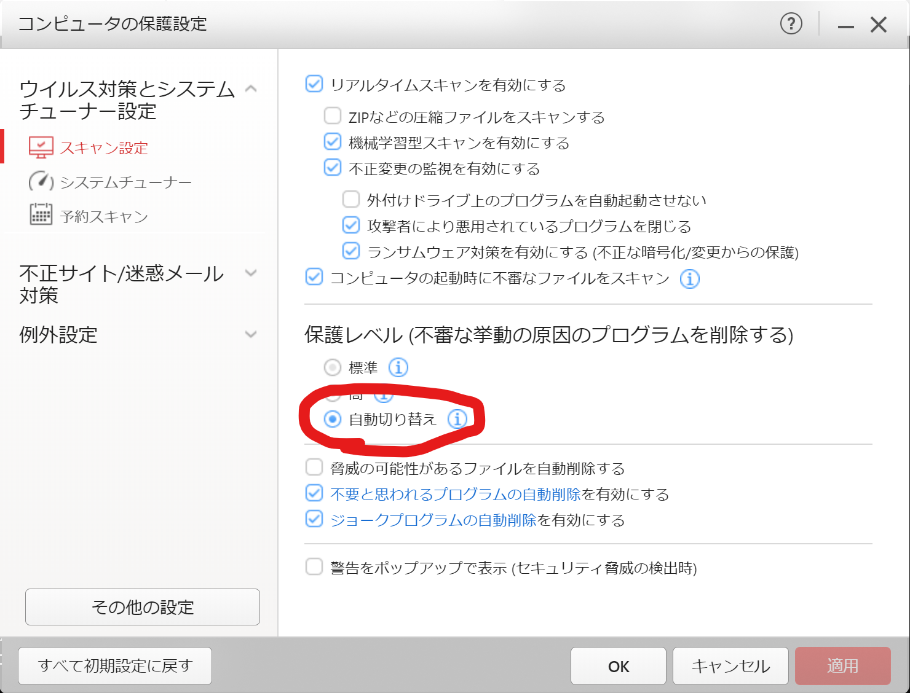
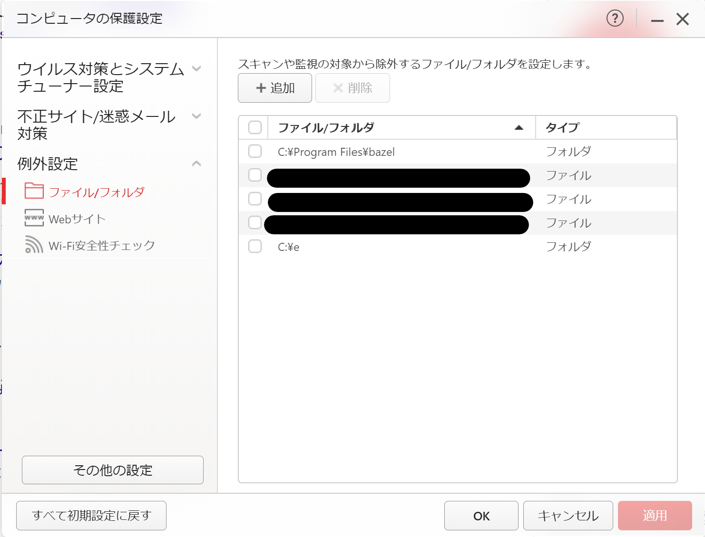
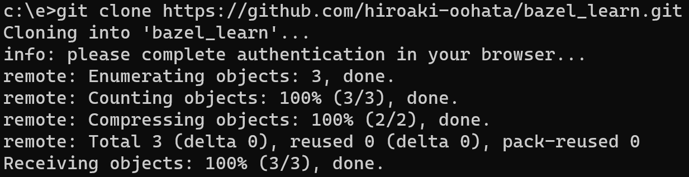
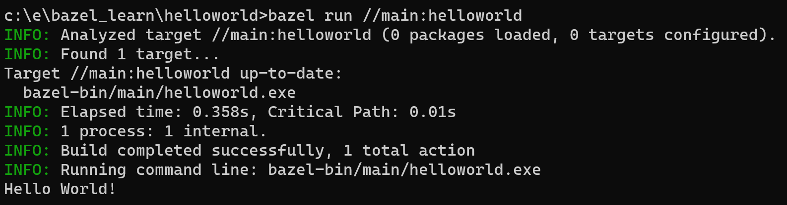

# bazel_learn
bazelの導入から使い方までを理解するためのプロジェクト

## bazelとは
一言で言うとmakeの次世代ビルドツール。  
Googleが独自に開発している。  
https://bazel.build/about?hl=ja  
※コンパイラではないので、コンパイラは別途用意する必要がある。（gccなどがコンパイラ）

makeはプラットフォームに依存せず、多くのプログラミング言語に対応できる。記述ルールがシンプルであり理解しやすいというメリットもある。半面、複雑なルールを記述しにくかったり、並列処理が苦手といったデメリットもある。

bazelの特徴  
1. 多くの言語に対応している  
2. ビルド、テストのルールが用意されている  
3. ビルド時にプロジェクトを汚さない  
4. 並列ビルドにより時間短縮が期待できる  
5. パッケージ化、Dockerイメージ作成ができる（細かいことはできない）

## Windowsに導入
### Bazelのインストール
https://qiita.com/ma-szk/items/05bfc4d0c731071fdeec  
（bazel.exeにリネームして使用するのがミソ）  
　記載どおりに、C:\Program Files\bazel\bazel.exeに置いてみたら動いた(;^_^A)

### コンパイラのインストール
https://www.kkaneko.jp/tools/win/buildtool2022.html  
1. **Build Tools for Visual Studio 2022**　をインストールする  
2. コマンドプロンプトを起動して、以下のコマンドを入力する。  
`set BAZEL_VC=C:\Program Files (x86)\Microsoft Visual Studio\2022\BuildTools\VC`  
※上記フォルダが生成されていなければ、インストールで何か失敗しているかも。

### ウイルスバスターの無効化（任意）
ビルドによって生成されたexeファイルをウイルスと誤認されるため、検査対象から外しておく  
1. 保護レベルを下げる  

2. bael.exeを置いたパスとビルドするパスを設定する  
※サブフォルダも対象から外れるので、できるだけ親フォルダを設定するとよい。  

## Ubuntu(WSL2環境)に導入
（用意するか検討中・・・）

## 動作確認
### ビルドするコードを用意する
自作しても良いし、面倒であれば（gitがインストールされている環境であれば）以下から取得しても良い。  

*bazelが提供するオフィシャルなチュートリアル*  
`git clone https://github.com/bazelbuild/examples`  
（参考）https://bazel.build/start/cpp?hl=ja

*本プロジェクト*  
`git clone https://github.com/hiroaki-oohata/bazel_learn`  
（出力例）  

### ビルドする
本プロジェクトを使用することを前提に話を進める。  
1. コマンドプロンプトでビルドする  
※あらかじめ、WORKSPACEがあるディレクトリまで移動しておく必要あり。  
`bazel build //main:helloworld`  
2. コマンドプロンプトから実行する  
`bazel run //main:helloworld`  
3. 出力があることを確認する  
`Hello World!`  
（出力例）  

## 補足
### gitからcloneする準備
初期設定としてユーザーネームとメールアドレスをgitに覚えさせないと使えないので注意  
`git config --global user.name "xxxxxxxxxxxxx"`  
`git config --global user.email yyyy@xxxx.co.jp`  