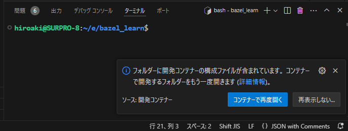
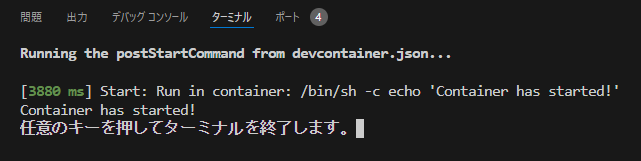
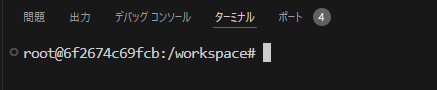
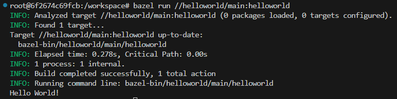
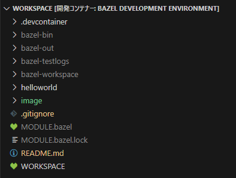

# bazel_learn
bazelの導入から使い方までを理解するためのプロジェクト

## bazelとは
一言で言うとmakeの次世代ビルドツール。  
Googleが独自に開発している。  
https://bazel.build/about?hl=ja  
※コンパイラではないので、コンパイラは別途用意する必要がある。（gccなどがコンパイラ）

makeはプラットフォームに依存せず、多くのプログラミング言語に対応できる。記述ルールがシンプルであり理解しやすいというメリットもある。半面、複雑なルールを記述しにくかったり、並列処理が苦手といったデメリットもある。

bazelの特徴  
1. 多くの言語に対応している  
2. ビルド、テストのルールが用意されている  
3. ビルド時にプロジェクトを汚さない  
4. 並列ビルドにより時間短縮が期待できる  
5. パッケージ化、Dockerイメージ作成ができる（細かいことはできない）

## １）Windowsに導入する場合（非推奨）
### Bazelのインストール
https://qiita.com/ma-szk/items/05bfc4d0c731071fdeec  
（bazel.exeにリネームして使用するのがミソ）  
　記載どおりに、C:\Program Files\bazel\bazel.exeに置いてみたら動いた(;^_^A)

### コンパイラのインストール
https://www.kkaneko.jp/tools/win/buildtool2022.html  
1. **Build Tools for Visual Studio 2022**　をインストールする  
2. コマンドプロンプトを起動して、以下のコマンドを入力する。  
`set BAZEL_VC=C:\Program Files (x86)\Microsoft Visual Studio\2022\BuildTools\VC`  
※上記フォルダが生成されていなければ、インストールで何か失敗しているかも。

### ウイルスバスターの無効化（任意）
ビルドによって生成されたexeファイルをウイルスと誤認されるため、検査対象から外しておく  
1. 保護レベルを下げる  

2. bael.exeを置いたパスとビルドするパスを設定する  
※サブフォルダも対象から外れるので、できるだけ親フォルダを設定するとよい。  

## ２）devcontainerで導入する場合（推奨）
本プロジェクトに登録している[.devcontainer](.devcontainer)を使用することでcontainer内でbazelを導入することができる。  
使用方法は[動作確認](#動作確認)にて説明する。  
（devcontainerの詳細については説明しない）  

## 動作確認
### ビルドするコードを用意する
自作しても良いし、面倒であれば（gitがインストールされている環境であれば）以下から取得しても良い。  
gitがなければ、Code - download ZIP でDLしても良い。  

*bazelが提供するオフィシャルなチュートリアル*  
`git clone https://github.com/bazelbuild/examples`  
（参考）https://bazel.build/start/cpp?hl=ja  

*本プロジェクト*  
`git clone https://github.com/hiroaki-oohata/bazel_learn`  
（出力例）  
  

### devcontainerでbazelを導入する場合にはdevcontainerを起動する
本プロジェクトを使用することを前提に話を進める。  
1. プロジェクトを開く
containerで開くことを進めてくる。  
  

2. containerをビルドする
自動的にビルドが開始する。  
下記の出力が出れば成功。  
  

3. containerをビルド成功を確認する
成功すればbazelがインストールされた環境ができたことになる。  
下記の例だと root ユーザーで workspace フォルダを開いた状態になっている。  
（containerで開く前と違うハズ）  
  

4. 確認
念のため`bazel version`と打ってみましょう。  
container内にだけインストールされたことがわかります。  
　・ホストPC(WSL2)： 見つからないというエラーが出る  
　・container内： versionが出力される  

### ビルドする
本プロジェクトを使用することを前提に話を進める。  
1. コマンドプロンプトでビルドする  
※WORKSPACEがあるディレクトリで実行する。  
`bazel build //helloworld/main:helloworld`  

2. コマンドプロンプトから実行する  
`bazel run //helloworld/main:helloworld`  

3. 出力があることを確認する  
`Hello World!`  
（出力例）  
  

4. ビルドしたバイナリオブジェクトはプロジェクト直下に出力される  
  

## 補足
### gitからcloneする準備
初期設定としてユーザーネームとメールアドレスをgitに覚えさせないと使えないので注意  
`git config --global user.name "xxxxxxxxxxxxx"`  
`git config --global user.email yyyy@xxxx.co.jp`  